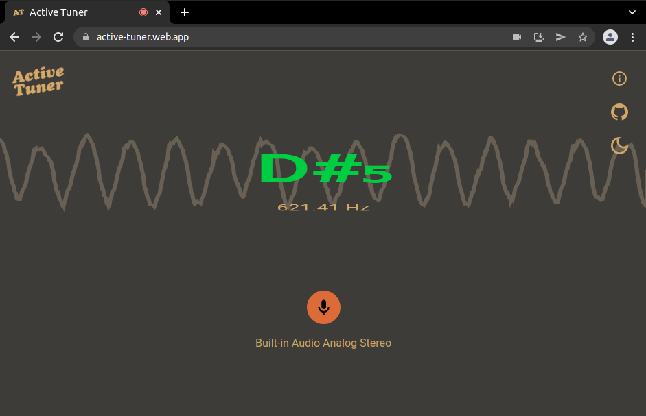

# Active Tuner 
Versão: 1.0.0

Analisador de frequências sonoras, para auxílio na afinação de instrumentos musicais. Ele detecta frequências entre C₀ (16,35 Hertz) e B₈  (7902,13 Hertz), e exibe a nota referente a frequência captada.

## Disclaimer
  - Esse aplicativo se limita pela capacidade funcional do dispositivo de áudio a executá-lo, tanto o microfone quanto a placa de som e suas capacidades.
  - Em testes, os navegadores Chrome e baseados em Chromium, tiveram melhor performance com a representação de animações gráficas.

## Objetivos do projeto
O Active Tuner tem como objetivo o aprendizado do funcionamento de ondas sonoras e sua representação digital. Foi necessário a compreensão básica de algoritmos para a conversão do sinal analógico para digital. O aprendizado do funcionamento da API de áudio utilizado pelos browsers, ex. Chrome e Firefox. E a construção de uma aplicação Web que pudesse representar a frequência e sua nota referente no momento da captação.

## Tecnologias e Ferramentas

### Web Audio API  
  - Para captação e representação das ondas sonoras no navegador.
Algoritmo de detecção de pitch (Pitch detection algorithm - PDA)
  - Utilizado para determinar a frequência de um sinal sonoro digital

### Canvas API
  - Utilizado para a representação gráfica das notas e das frequências;
  - Melhor tecnologia encontrada para a fluidez da exibição, devido ao alto volume de dados e tempo demandado para a atualização das notas e frequências em tela.

### React  
  - Framework utilizado para a construção da aplicação web

### Typescript/Javascript  
  - Linguagem utilizada para a manipulação da Web Audio API
  - Efetuar cálculos dos algoritmos de detecção de pitch a correlação;
  - Construção da aplicação com React.

## Desenvolvedores
  - <a href="https://www.linkedin.com/in/renanlopes77/" target="_blank">Renan Lopes</a>
  - <a href="https://www.linkedin.com/in/wesley-a/" target="_blank">Wesley Araujo</a>

## Agradecimentos
  - <a href="https://github.com/freirezinho" target="_blank">Saulo Freire</a>

